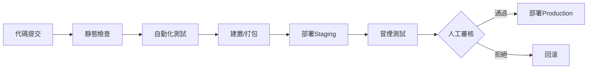

# {{專案名稱}} — 操作與部署手冊

> **版本：** {{版本號}}  
> **最後更新：** {{YYYY-MM-DD}}  
> **負責人：** {{DevOps / SRE 團隊}}

---

## 1. CI/CD 流程

<!-- 必填：Pipeline 階段與觸發條件 -->

在技術架構確定之後，本文件描述如何將系統安全地交付到各環境。

### 1.1 Pipeline 概覽



### 1.2 觸發條件

| 事件           | 觸發的 Pipeline       | 部署目標   |
| -------------- | --------------------- | ---------- |
| Push to `main` | 完整 CI/CD            | Staging    |
| Tag `v*`       | Release Pipeline      | Production |
| Pull Request   | CI only (lint + test) | —          |

---

## 2. 環境變數配置

<!-- 必填：變數名稱、用途、預設值 -->

| 變數名稱               | 用途           | 預設值        | 敏感      |
| ---------------------- | -------------- | ------------- | --------- |
| `NODE_ENV` / `APP_ENV` | 執行環境       | `development` | 否        |
| `DATABASE_URL`         | 資料庫連線字串 | —             | 是 `***`  |
| `REDIS_URL`            | 快取連線字串   | —             | 是 `***`  |
| `JWT_SECRET`           | Token 簽名金鑰 | —             | 是 `***`  |
| `API_PORT`             | 服務監聽埠     | `3000`        | 否        |
| `LOG_LEVEL`            | 日誌等級       | `info`        | 否        |
| `{{VAR_NAME}}`         | {{用途}}       | {{預設值}}    | {{是/否}} |

> 敏感變數不可寫入版本控制，應透過 Secret Manager 或 CI/CD 環境注入。

---

## 3. 部署步驟

<!-- 必填：逐步操作（含 rollback） -->

### 3.1 Staging 部署

```bash
# 1. 確認分支已合併至 main
git checkout main && git pull

# 2. 執行部署
{{deploy-staging-command}}

# 3. 驗證
{{health-check-command}}
```

### 3.2 Production 部署

```bash
# 1. 建立版本標籤
git tag v{{版本號}}
git push origin v{{版本號}}

# 2. CI/CD 自動觸發 Release Pipeline

# 3. 驗證
{{prod-health-check-command}}
```

### 3.3 回滾 (Rollback)

```bash
# 回滾至前一版本
{{rollback-command}}

# 驗證回滾成功
{{health-check-command}}
```

---

## 4. 監控與日誌

<!-- 必填：監控指標、Log 查看路徑、告警規則 -->

### 4.1 核心監控指標

| 指標               | 工具                     | 告警閾值     |
| ------------------ | ------------------------ | ------------ |
| API 回應時間 (P95) | {{Prometheus / Datadog}} | > {{ms}} ms  |
| 錯誤率 (5xx)       | {{工具}}                 | > {{x}}%     |
| CPU 使用率         | {{工具}}                 | > {{x}}%     |
| 記憶體使用率       | {{工具}}                 | > {{x}}%     |
| 資料庫連線池       | {{工具}}                 | 可用 < {{n}} |

### 4.2 日誌查看

| 環境       | 日誌位置         | 查看方式       |
| ---------- | ---------------- | -------------- |
| 本地開發   | stdout / `logs/` | 直接查看       |
| Staging    | {{路徑或服務}}   | `{{查詢指令}}` |
| Production | {{路徑或服務}}   | `{{查詢指令}}` |

### 4.3 告警規則

| 告警名稱   | 條件         | 通知管道                      | 嚴重等級     |
| ---------- | ------------ | ----------------------------- | ------------ |
| {{告警名}} | {{觸發條件}} | {{Slack / PagerDuty / Email}} | {{P1/P2/P3}} |

---

## 5. 災難復原 (DR)

<!-- 必填：備份策略、RTO/RPO、復原步驟 -->

### 5.1 備份策略

| 備份對象 | 頻率              | 保留期限 | 儲存位置                  |
| -------- | ----------------- | -------- | ------------------------- |
| 資料庫   | {{每日 / 每小時}} | {{n}} 天 | {{S3 / GCS / Azure Blob}} |
| 檔案儲存 | {{頻率}}          | {{n}} 天 | {{位置}}                  |
| 設定檔   | 版本控制          | 永久     | Git                       |

### 5.2 復原目標

| 指標                           | 目標值     |
| ------------------------------ | ---------- |
| RTO (Recovery Time Objective)  | < {{時間}} |
| RPO (Recovery Point Objective) | < {{時間}} |

### 5.3 復原步驟

1. **確認災難範圍**：判斷受影響的服務與資料範圍。
2. **啟動備援環境**：{{切換至備援區域/啟動備份實例}}。
3. **還原資料**：從最近備份點還原資料庫。
4. **驗證服務**：執行完整健康檢查與冒煙測試。
5. **通知利害關係人**：更新狀態頁並通知相關團隊。

---

<!-- 驗收清單（產出後自行核對，核對完畢後刪除此區塊）
- [ ] CI/CD Pipeline 階段與觸發條件清楚
- [ ] 環境變數表完整且敏感值已標記
- [ ] 部署步驟可照做（含 rollback）
- [ ] 監控指標有量化告警閾值
- [ ] 日誌查看路徑明確
- [ ] DR 策略含 RTO/RPO 與復原步驟
-->
