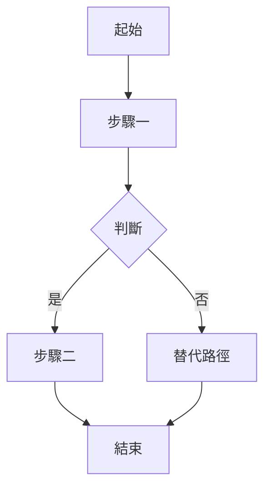

# {{專案名稱}} — 產品需求文件 (PRD)

> **版本：** {{版本號}}  
> **最後更新：** {{YYYY-MM-DD}}  
> **負責人：** {{PM / 負責人}}

---

## 1. 商業背景與目標

<!-- 必填：描述為什麼要做這個產品/功能 -->

### 1.1 問題陳述

{{描述目前存在的痛點或市場機會}}

### 1.2 產品目標

{{列出 2–3 個可量化的產品目標，例如「上線 3 個月內達到 1,000 DAU」}}

### 1.3 成功指標 (KPI)

| 指標       | 目標值   | 衡量方式     |
| ---------- | -------- | ------------ |
| {{指標名}} | {{目標}} | {{如何測量}} |

---

## 2. 目標用戶與使用者案例

<!-- 必填：至少定義 2 個 Use Case -->

### 2.1 目標用戶 (Persona)

| 角色       | 描述         | 核心需求     |
| ---------- | ------------ | ------------ |
| {{角色 A}} | {{背景描述}} | {{需要什麼}} |
| {{角色 B}} | {{背景描述}} | {{需要什麼}} |

### 2.2 使用者案例 (Use Cases)

#### UC-01：{{使用案例標題}}

- **前置條件：** {{觸發前需要滿足的狀態}}
- **主要流程：**
  1. {{步驟 1}}
  2. {{步驟 2}}
  3. {{步驟 3}}
- **後置條件：** {{完成後的系統狀態}}
- **例外流程：** {{錯誤或分支情境}}

#### UC-02：{{使用案例標題}}

- **前置條件：** {{觸發前需要滿足的狀態}}
- **主要流程：**
  1. {{步驟 1}}
  2. {{步驟 2}}
- **後置條件：** {{完成後的系統狀態}}

---

## 3. 功能列表與優先級

<!-- 必填：表格含 P0/P1/P2 標記 -->

| ID   | 功能名稱   | 描述     | 優先級 | 驗收標準       |
| ---- | ---------- | -------- | ------ | -------------- |
| F-01 | {{功能名}} | {{簡述}} | P0     | {{可測試條件}} |
| F-02 | {{功能名}} | {{簡述}} | P1     | {{可測試條件}} |
| F-03 | {{功能名}} | {{簡述}} | P2     | {{可測試條件}} |

---

## 4. 流程圖

<!-- 必填：使用 Mermaid 或附上外部原型連結 -->

**UI/UX 原型連結：** {{Figma / Whimsical URL 或「待補充」}}

---

## 5. 非功能性需求 (NFR)

<!-- 必填：效能、安全性、可用性指標 -->

| 類別   | 指標               | 目標值                |
| ------ | ------------------ | --------------------- |
| 效能   | API 回應時間 (P95) | < {{ms}} ms           |
| 效能   | 併發用戶數         | >= {{數量}}           |
| 安全性 | 資料加密           | {{TLS 1.3 / AES-256}} |
| 安全性 | 認證機制           | {{JWT / OAuth 2.0}}   |
| 可用性 | SLA                | >= {{99.x}}%          |
| 可用性 | RTO / RPO          | {{時間}} / {{時間}}   |

---

## 6. 驗收標準 (Acceptance Criteria)

<!-- 必填：每個功能至少 1 條可測試條件 -->

| 功能 ID | 驗收條件                 | 測試方式      |
| ------- | ------------------------ | ------------- |
| F-01    | {{Given-When-Then 格式}} | {{手動/自動}} |
| F-02    | {{Given-When-Then 格式}} | {{手動/自動}} |

---

## 7. 里程碑與時程

| 階段    | 交付物       | 預計日期       |
| ------- | ------------ | -------------- |
| Phase 1 | {{MVP 功能}} | {{YYYY-MM-DD}} |
| Phase 2 | {{進階功能}} | {{YYYY-MM-DD}} |

---

<!-- 驗收清單（產出後自行核對，核對完畢後刪除此區塊）
- [ ] 商業背景清楚說明問題與目標
- [ ] 至少 2 個 Use Case
- [ ] 功能列表含優先級標記
- [ ] 流程圖存在且邏輯正確
- [ ] NFR 指標量化且合理
- [ ] 每個功能有對應驗收標準
-->
