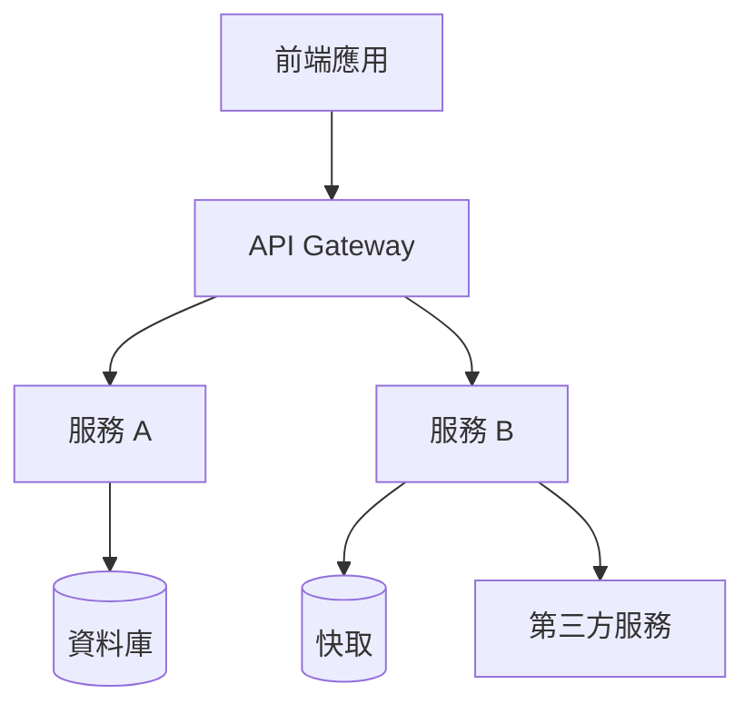
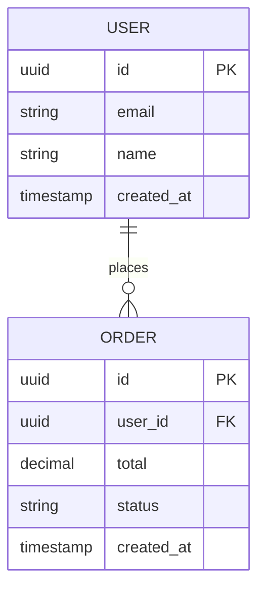

# {{專案名稱}} — 技術設計文件 (TDD)

> **版本：** {{版本號}}  
> **最後更新：** {{YYYY-MM-DD}}  
> **負責人：** {{Tech Lead / 架構師}}

---

## 1. 系統架構圖

<!-- 必填：模組劃分、服務邊界、第三方整合 -->

在定義了產品要「做什麼」之後，本文件聚焦於「如何做」——從系統架構、資料模型到關鍵演算法的技術決策。

### 1.1 高層架構



### 1.2 模組劃分

| 模組名稱   | 職責         | 對應 PRD 功能 |
| ---------- | ------------ | ------------- |
| {{模組 A}} | {{職責描述}} | F-01, F-02    |
| {{模組 B}} | {{職責描述}} | F-03          |

### 1.3 第三方服務整合

| 服務       | 用途     | 通訊方式          | SLA     |
| ---------- | -------- | ----------------- | ------- |
| {{服務名}} | {{用途}} | REST / gRPC / SDK | {{SLA}} |

---

## 2. 資料庫設計

<!-- 必填：ERD、索引策略、資料字典 -->

從架構層進入資料層——以下定義系統的持久化方案。

### 2.1 ERD (Entity-Relationship Diagram)



### 2.2 資料字典

| 表名      | 欄位       | 類型     | 說明     | 約束                      |
| --------- | ---------- | -------- | -------- | ------------------------- |
| {{table}} | {{column}} | {{type}} | {{desc}} | {{PK/FK/NOT NULL/UNIQUE}} |

### 2.3 索引策略

| 表名      | 索引名稱     | 欄位        | 類型                | 理由         |
| --------- | ------------ | ----------- | ------------------- | ------------ |
| {{table}} | {{idx_name}} | {{columns}} | B-Tree / Hash / GIN | {{查詢場景}} |

---

## 3. 關鍵演算法

<!-- 必填：偽代碼或流程圖描述複雜邏輯 -->

定義完資料結構後，以下說明核心業務邏輯的演算法設計。

### 3.1 {{演算法名稱}}

**問題描述：** {{這段演算法要解決什麼}}

**偽代碼：**

```
FUNCTION {{functionName}}(input):
  VALIDATE input
  IF condition THEN
    PROCESS step_a
  ELSE
    PROCESS step_b
  END IF
  RETURN result
END FUNCTION
```

**時間複雜度：** O({{n}})  
**空間複雜度：** O({{n}})

---

## 4. 技術選型理由

<!-- 必填：記錄選擇框架/工具的決策過程 -->

| 技術領域 | 選定方案 | 備選方案 | 選擇理由 |
| -------- | -------- | -------- | -------- |
| 語言     | {{選定}} | {{備選}} | {{理由}} |
| 框架     | {{選定}} | {{備選}} | {{理由}} |
| 資料庫   | {{選定}} | {{備選}} | {{理由}} |
| 快取     | {{選定}} | {{備選}} | {{理由}} |
| 訊息佇列 | {{選定}} | {{備選}} | {{理由}} |

---

## 5. 安全設計

<!-- 必填：認證、授權、資料加密策略 -->

| 面向         | 策略                         | 實作方式   |
| ------------ | ---------------------------- | ---------- |
| 認證 (AuthN) | {{JWT / OAuth 2.0 / SSO}}    | {{說明}}   |
| 授權 (AuthZ) | {{RBAC / ABAC}}              | {{說明}}   |
| 傳輸加密     | TLS 1.3                      | 全站 HTTPS |
| 靜態資料加密 | {{AES-256 / 資料庫原生加密}} | {{說明}}   |
| 敏感資料處理 | {{脫敏/遮蔽策略}}            | {{說明}}   |

---

## 6. 擴展性考量

<!-- 必填：水平/垂直擴展方案 -->

| 瓶頸點     | 擴展策略                | 觸發條件        |
| ---------- | ----------------------- | --------------- |
| {{應用層}} | 水平擴展 (Auto Scaling) | CPU > {{x}}%    |
| {{資料庫}} | 讀寫分離 / Sharding     | QPS > {{n}}     |
| {{快取}}   | 叢集模式                | 記憶體 > {{x}}% |

---

<!-- 驗收清單（產出後自行核對，核對完畢後刪除此區塊）
- [ ] 系統架構圖包含所有核心模組與第三方服務
- [ ] ERD 涵蓋所有主要實體與關聯
- [ ] 資料字典與索引策略完整
- [ ] 複雜邏輯有偽代碼或流程圖
- [ ] 技術選型有明確的「為什麼」
- [ ] 安全設計覆蓋 AuthN/AuthZ/加密
- [ ] 擴展性方案有量化觸發條件
-->
